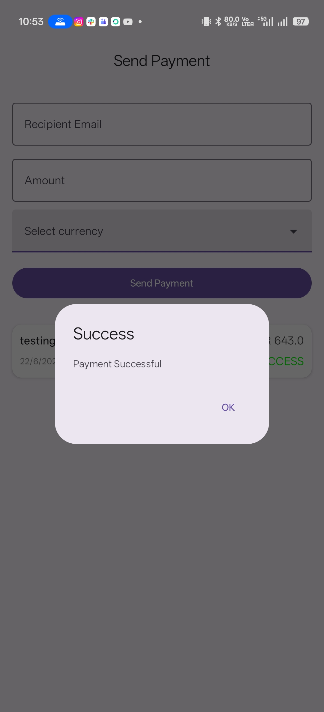
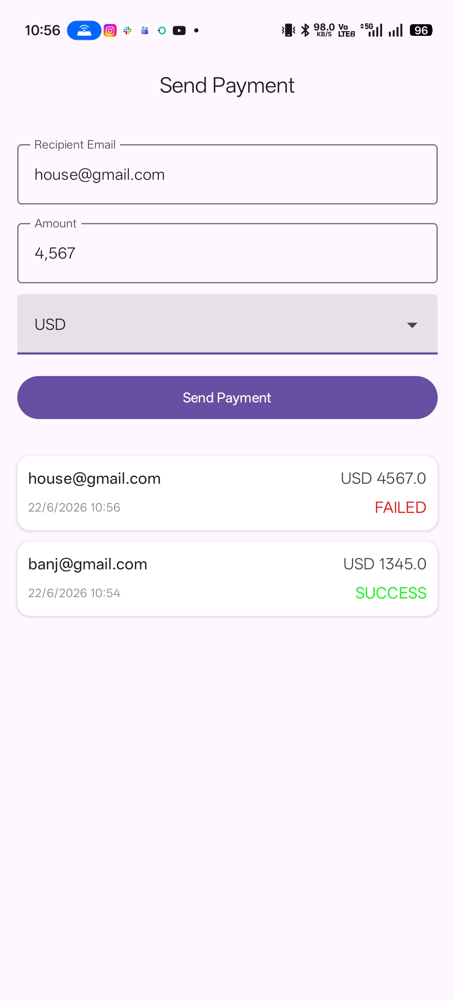
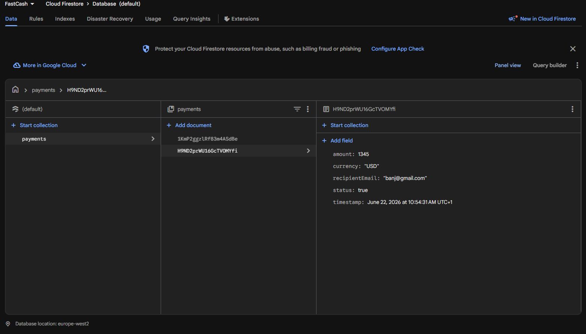
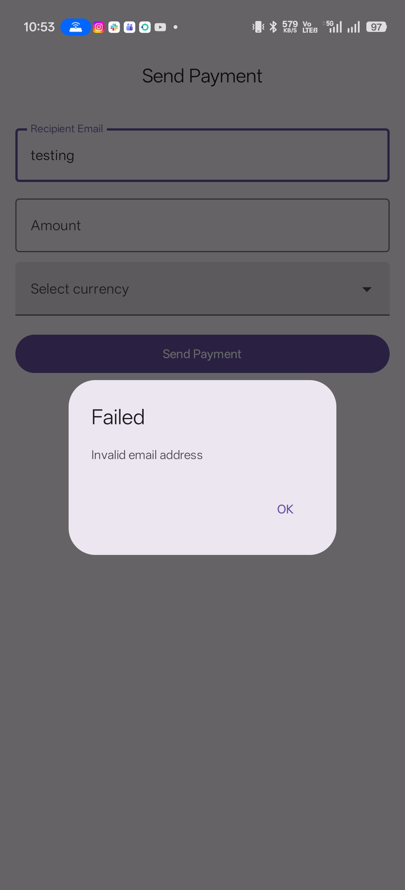
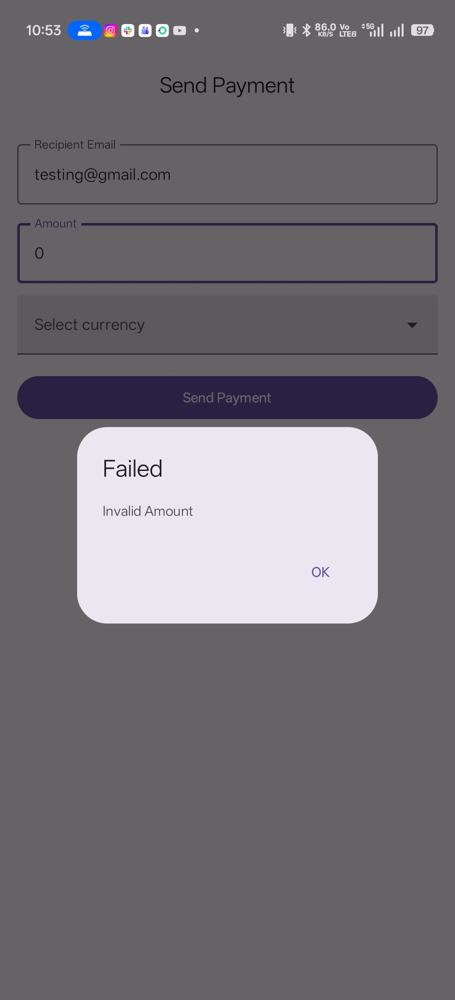

# FastCash - KMP Payment App
[](https://github.com/kelly/FastCash)

A cross-platform FinTech application built with **Kotlin Multiplatform (KMP)**, **Firebase**, and **Jetpack Compose**. This project demonstrates Clean Architecture, automated testing (BDD, UI, Performance), and shared business logic for mobile platforms.

---

## 📺 Demo & Screenshots

### 🎥 Demo Script (Walkthrough)
To verify the app's functionality, follow these steps:
1.  **Launch**: Open the app on an Android emulator.
2.  **Enter Details**: Input a recipient email (e.g., `test@example.com`), amount (e.g., `100.00`), and select `USD`.
3.  **Validation**: Try entering an invalid email or negative amount to see real-time validation logic from the shared KMP module.
4.  **Send Payment**: Click the **Send Payment** button.
5.  **Observe**: Watch the loading indicator, followed by a "Payment successful" confirmation.
6.  **Verify History**: Scroll to the "Recent Transactions" list. The new payment will appear instantly via Firestore real-time listeners.
7.  **Firebase**: (Optional) Observe the new document created in the `payments` collection in your Firebase Console.

### 📸 Screenshots
| Payment Form | Details Filled | Success State |
| :---: | :---: | :---: |
|  |  |  |

| Transaction History | Firebase Console |
| :---: | :---: |
|  |  |

#### Validation Examples
| Email Error | Amount Error | Currency Error |
| :---: | :---: | :---: |
|  |  |  |

---

## 🚀 Architecture & KMP Potential
This project uses **Clean Architecture** to ensure the code is testable, maintainable, and platform-agnostic.

### KMP Structure
- **`:sharedLogic`**: Contains 100% of the business logic, including:
    - **Domain**: Use Cases for payment processing and validation logic.
    - **Data**: Ktor API implementation and Repository patterns.
- **`:sharedUI`**: Uses **Compose Multiplatform** to share UI components between platforms, significantly reducing development time.
    - **Presentation**: Shared ViewModels and UI state management logic.
    - **Screen**: A unified `PaymentFormScreen` that handles both payment initiation and real-time transaction history in a single reactive flow.
- **`:androidApp`**: The Android entry point, handling platform-specific configurations like Firebase initialization.

### Cross-Platform Potential
The architecture is "iOS-Ready." By using the **Expect/Actual** pattern and **Interface Abstraction**:
- **Logic**: The same `ProcessPaymentUseCase` and `ValidateEmailUseCase` can be used by an iOS Swift UI app.
- **Data**: To support iOS, one would simply implement the `DatabaseRepository` using the Firebase iOS SDK in the `iosMain` source set.
- **UI**: The Compose code in `sharedUI` can be rendered on iOS with minimal platform-specific glue code.

---

## 🛠 Tech Stack
- **UI**: Jetpack Compose / Compose Multiplatform
- **DI**: Koin for Dependency Injection
- **Networking**: Ktor with JSON Serialization
- **Database**: Firebase Firestore (with real-time Flow support)
- **Concurrency**: Kotlin Coroutines & Flow

---

## 🧪 Testing Instructions

### ✅ Unit Tests (Shared Logic)
Validates core business rules and validation logic.
```bash
./gradlew :sharedLogic:test
```

### 🥒 BDD Tests (Cucumber)
End-to-end business scenarios in plain English.
- **File**: `sharedLogic/src/commonTest/resources/features/payments.feature`
```bash
./gradlew :sharedLogic:testAndroidHostTest
```

### 📱 UI Testing (Appium)
Automated UI flow testing.
1. Start Appium Server: `appium`
2. Run tests:
```bash
./gradlew :appiumTests:test
```

### 📈 Performance Testing (JMeter)
API Load testing for the `/payments` endpoint.
- **Test Plan**: `jmeter/fast_cash_test_plan.jmx`
- **Report**: Open `jmeter/html_report/index.html` in a browser to see response time percentiles and throughput.

---
**Author**: Kelly
**GitHub**: [github.com/kelly/FastCash](https://github.com/kelly/FastCash)
